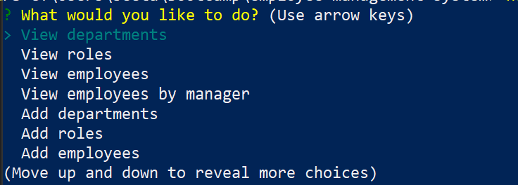
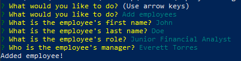

# Employee Management System


## Description
Employee Management System is a CLI application where a business owner or employer can view and manage the departments, roles, and employees in a company.

## Table of Contents
- [Description](#description)
- [Installation](#installation)
- [Usage](#usage)
- [Contributing](#contributing)
- [Questions](#questions)

## Installation
1. Download/clone this repository [Employee Management System](https://github.com/melissa-tan/employee-management-system.git)
	```
	git clone https://github.com/melissa-tan/employee-management-system.git
	```
	
2. Install dependencies
	```
	npm install
	```

3. Run the schema.sql in your database
    ```
    drop database if exists employees_db;
    create database employees_db;

    use employees_db;

    create table department (
    id int auto_increment primary key,
    name varchar(30) unique not null
    );

    create table role (
    id int auto_increment primary key,
    title varchar(30) unique not null,
    salary DECIMAL not null,
    department_id int not null,
    foreign key (department_id) references department(id) ON DELETE CASCADE
    );

    create table employee (
    id int auto_increment primary key,
    first_name varchar(30) not null,
    last_name varchar(30) not null,
    role_id int not null,
    manager_id int,
    foreign key (role_id) references role(id) ON DELETE CASCADE,
    constraint manager_fk foreign key (manager_id) references employee(id) ON DELETE SET NULL
    );
    ```

4. (Optional) Run seed.sql in your database for starter data

## Usage
1. Run server.js
    ```
    node server.js
    ```

2. Scroll through the options and select the action that you woud like to take
    

3. If you select the option to add, update, or remove information, please follow the prompted information.
    

This is a full video tutorial on how to use the program! <br>
Please click on thumbnail to view video. </br>
	[](http://www.youtube.com/watch?v=UAsQzuNNvoA "Employee Management System Full Demo-Click to Watch!")

## Contribution
#### Contributors
[Melissa Tan](https://github.com/melissa-tan)


## Questions
If you have any questions or see any issues, please submit an [issue](https://github.com/melissa-tan/employee-management-system/issues) on GitHub!


